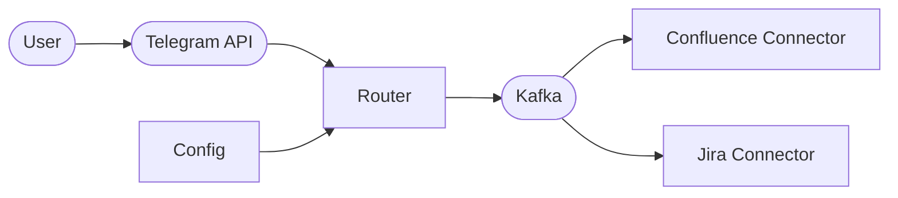

Wombat
======

Why Wombat? Working bot for messengers, w-m-bot.

Description
-----------

The main idea of this bot is providing possibility to add comments/texts to Jira tasks or Confluence articles directly from messenger.

The main idea:
1. User sends message directly to bot or places reaction in group chat.
2. Bot get messages from API.
3. Reads hashtags.
4. Sends comment to Jira or edits articles in Confluence based on hashtag.

